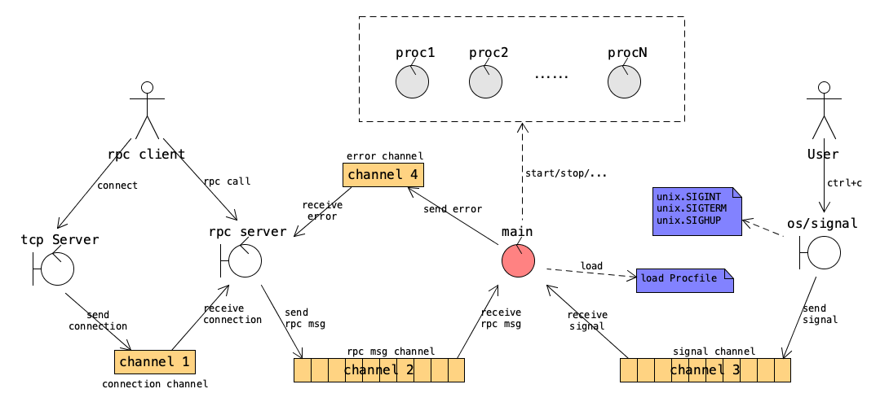

# Goreman

Clone of foreman written in golang.

https://github.com/ddollar/foreman

## Getting Started

    go install github.com/mattn/goreman@latest

## Usage

    goreman start

Will start all commands defined in the `Procfile` and display their outputs.
Any signals are forwarded to each process.

## Example

See [`_example`](_example/) directory

## License

MIT

## Design

The main goroutine loads `Procfile` and starts each command in the file. Afterwards, it is driven by the following two kinds of events, and then take proper action against the managed processes.

1. It receives a signal, which could be one of `SIGINT`, `SIGTERM`, and `SIGHUP`;
2. It receives an RPC call, which is triggered by the command `goreman run COMMAND [PROCESS...]`.

## Authors

Yasuhiro Matsumoto (a.k.a mattn)
