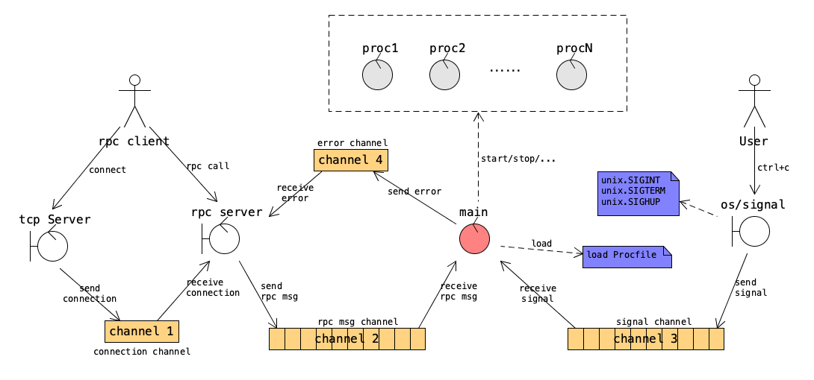

# Goreman

Clone of foreman written in golang.

https://github.com/ddollar/foreman

---

Goreman is a lightweight process management tool written in Go that serves as a modern clone of [Foreman](https://github.com/ddollar/foreman). It simplifies the management of multi-process applications defined in a `Procfile` by starting, stopping, and monitoring processes, handling signals gracefully, and even offering an RPC interface for remote control.

---


## Getting Started
```bash
    go install github.com/mattn/goreman@latest
```

## Table of Contents

- [Features](#features)
- [Installation](#installation)
- [Usage](#usage)
- [Commands](#commands)
- [Configuration](#configuration)
- [Process Management and RPC](#process-management-and-rpc)
- [Project Structure](#project-structure)
- [Testing](#testing)
- [Contributing](#contributing)
- [License](#license)
- [Authors](#authors)

---

## Features

- **Procfile-Based Process Management:** Define all your application processes in a single `Procfile` and have them managed concurrently.
- **Signal Handling:** System signals (SIGINT, SIGTERM, SIGHUP) are forwarded to all managed processes to ensure graceful shutdowns.
- **RPC Interface:** Control processes remotely via RPC commands (start, stop, restart, etc.).
- **Cross-Platform Support:** Built to work on both POSIX-compliant systems and Windows, with tailored process handling for each.
- **Export Functionality:** Export process configurations to alternative formats (e.g., Upstart) for integration with other systems.

---

## Installation

To install Goreman, make sure you have Go (version 1.23 or later) installed, then run:

```bash
    go install github.com/mattn/goreman@latest
```


## Usage

Goreman reads a Procfile to determine which processes to run. To start all processes defined in your Procfile, simply run:
```
    goreman start
```

This command initializes each process, setting environment variables (like PORT), and concurrently managing their outputs and lifecycle.

## Commands

Goreman provides several commands to help you manage your processes:

- **check:** Validates your Procfile and lists all defined processes.

```bash
    goreman check
```

- **help [TASK]:** Displays help information for a specific command or for Goreman in general.

```bash
    goreman help start
```

- **export [FORMAT] [LOCATION]:** Exports the process definitions into another format (e.g., Upstart).

```bash
    goreman export upstart /path/to/export
```

- **run COMMAND [PROCESS...]:** Issues RPC commands (like start, stop, restart, list, or status) to the processes.

```bash
    goreman run status
```

- **start [PROCESS]:** Starts all processes or only the specified ones if names are provided.

```bash
    goreman start web worker
```

- **version:** Outputs the current version of Goreman.

```bash
    goreman version
```

## Configuration

Goreman can be customized via command-line flags and a YAML configuration file named .goreman. Key configuration options include:

- **Procfile Location:** Use -f to specify a different Procfile (default: Procfile).
- **RPC Port:** Set the RPC server port with -p (default: 8555).
- **Base Port:** Define the starting port number for your processes using -b (default: 5000).
- **Automatic Port Setting:** Enable or disable automatic assignment of the PORT environment variable with -set-ports.

## Example

See [`_example`](_example/) directory

## Process Management and RPC

Goreman operates by reading your Procfile and launching each defined process. It listens for two key types of events:

1. **System Signals:** Upon receiving signals like SIGINT, SIGTERM, or SIGHUP, Goreman forwards these signals to each managed process to trigger a graceful shutdown.
2. **RPC Commands:** An internal RPC server (default port 8555) allows remote commands to start, stop, restart, or query the status of processes. This RPC interface makes it possible to integrate Goreman with other tools and scripts for dynamic process management.

## Project Structure

```plaintext
├── .github                # GitHub configurations and CI/CD workflows
│   ├── FUNDING.yml
│   └── workflows
│       ├── go.yml
│       └── release.yml
├── .gitignore
├── LICENSE
├── Makefile               # Build, test, and release automation
├── README.md              # Project documentation (this file)
├── _example               # Sample configuration and scripts
│   ├── .env
│   ├── Gemfile
│   ├── Procfile
│   ├── app.psgi
│   ├── web.go
│   └── web.rb
├── export.go              # Export functionality to other process managers
├── go.mod
├── go.sum
├── goreman_test.go        # Test suite for verifying functionality
├── images
│   └── design.png         # Architectural diagram of the process management flow
├── log.go                 # Custom logging implementation
├── main.go                # Main entry point for the application
├── proc.go                # Process start/stop/restart routines
├── proc_posix.go          # POSIX-specific process management
├── proc_windows.go        # Windows-specific process management
└── rpc.go                 # RPC server and client logic
```
## Testing

To run the test suite, execute:

```bash
    go test -v ./...
```

This command runs tests that cover process management, signal handling, RPC functionality, and more, ensuring that Goreman remains robust and reliable.


## Contributing

Contributions are welcome! Whether you are improving documentation, fixing bugs, or adding new features, please follow these guidelines:

- Documentation Enhancements: Expand or clarify existing documentation. Contributions that add new explanations or examples are highly encouraged.
- Code Contributions: Submit pull requests with clear descriptions and accompanying tests where applicable.
- Review Process: All changes should be made via pull requests. Ensure that your contribution adheres to the project's coding style and passes all tests.
- For further details, please review the contribution guidelines in the repository or open an issue to discuss your ideas.

## License

Goreman is licensed under the MIT License. Please review the license file for full details.

## Design

The main goroutine loads `Procfile` and starts each command in the file. Afterwards, it is driven by the following two kinds of events, and then take proper action against the managed processes.

1. It receives a signal, which could be one of `SIGINT`, `SIGTERM`, and `SIGHUP`;
2. It receives an RPC call, which is triggered by the command `goreman run COMMAND [PROCESS...]`.



## Authors

- **Yasuhiro Matsumoto (mattn)**
Creator and primary maintainer of Goreman
